# Amoledify

## Screenshots

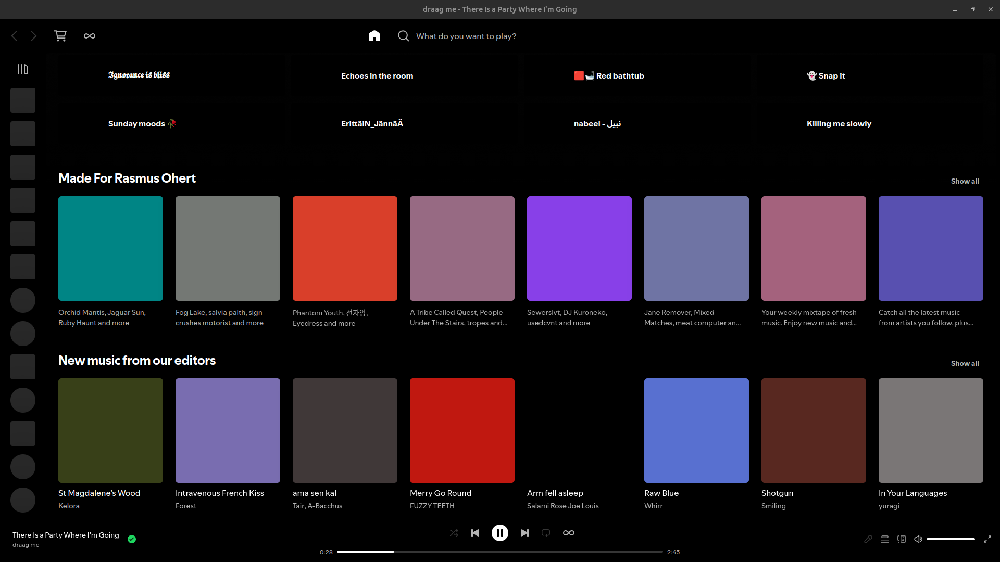

|                            |              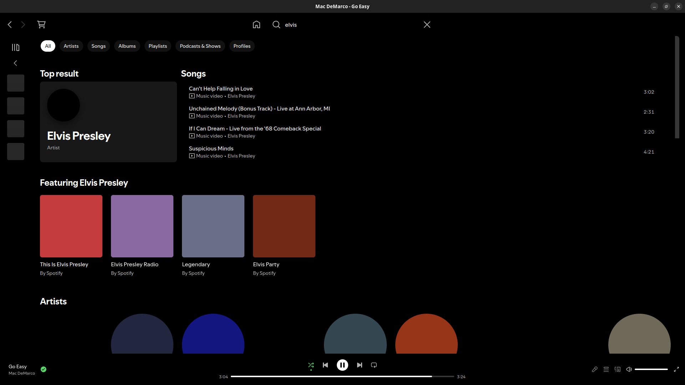              |          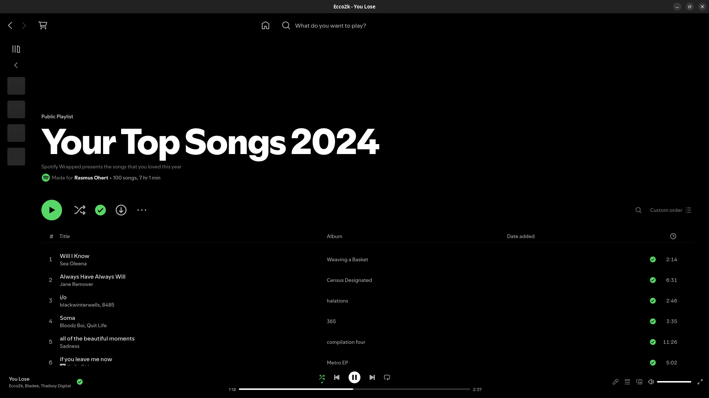           |
| :-----------------------------------------------------: | :---------------------------------------------------------: | :-----------------------------------------------------: |
|                          home                           |                           search                            |                        playlist                         |
|            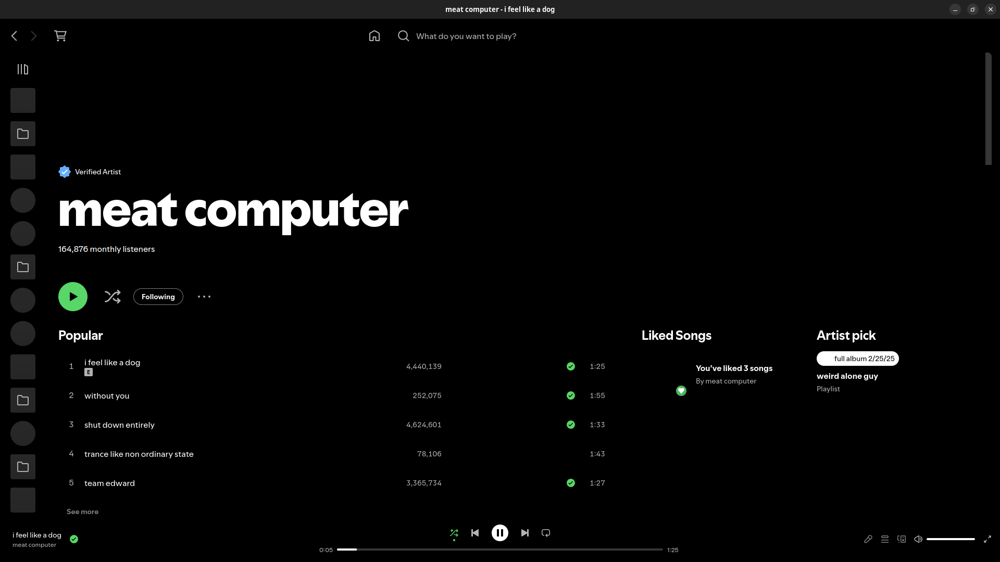            |               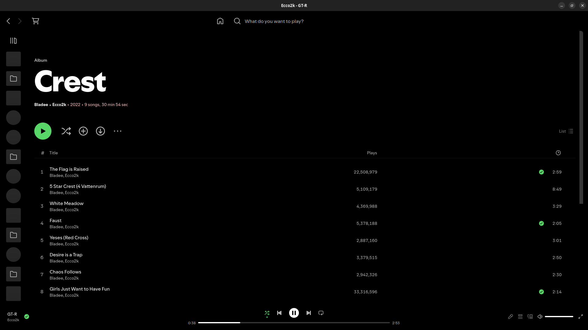               |           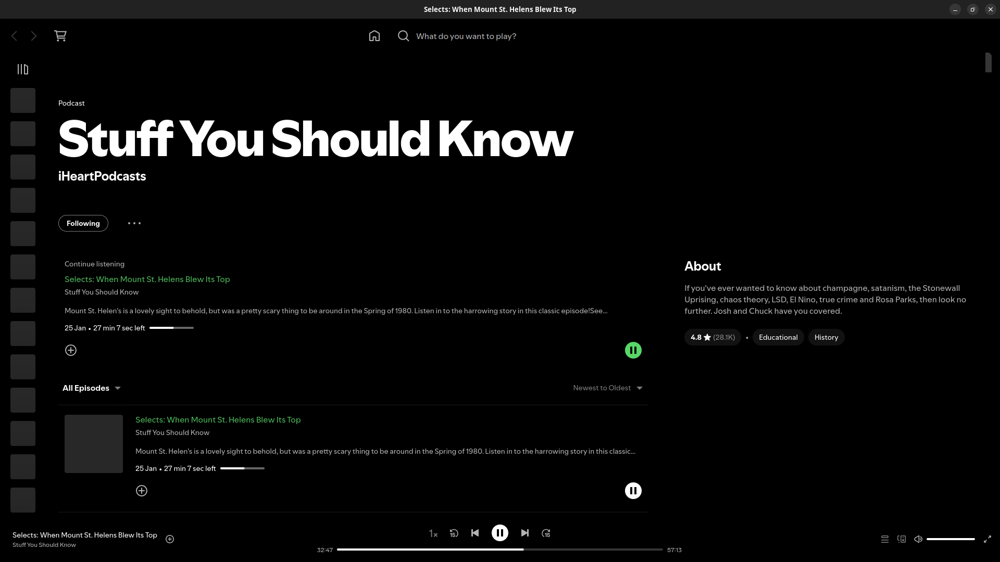           |
|                         artist                          |                            album                            |                         podcast                         |
| 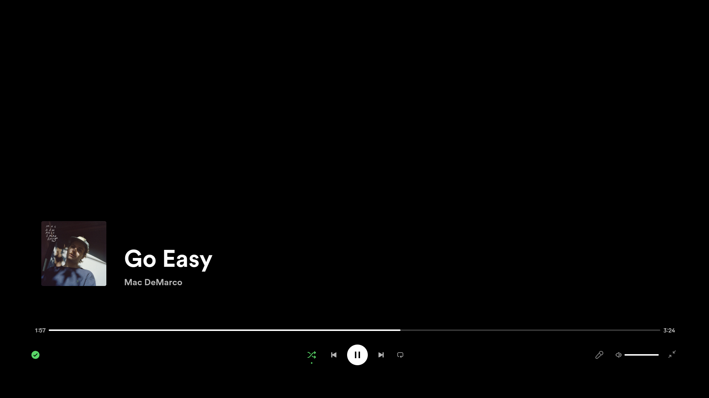 |  | 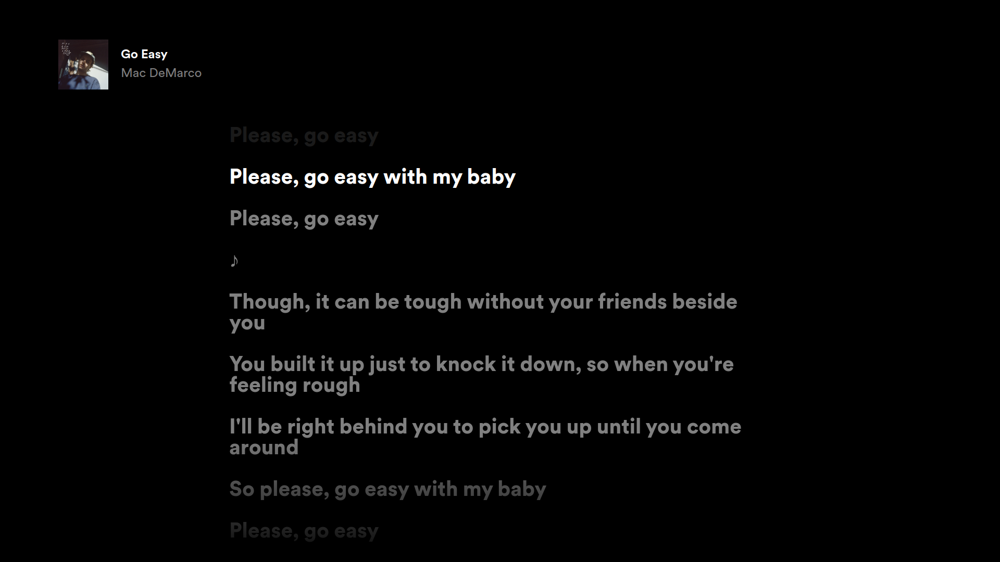 |
|                    fullscreen active                    |                     fullscreen inactive                     |                    fullscreen lyrics                    |
|            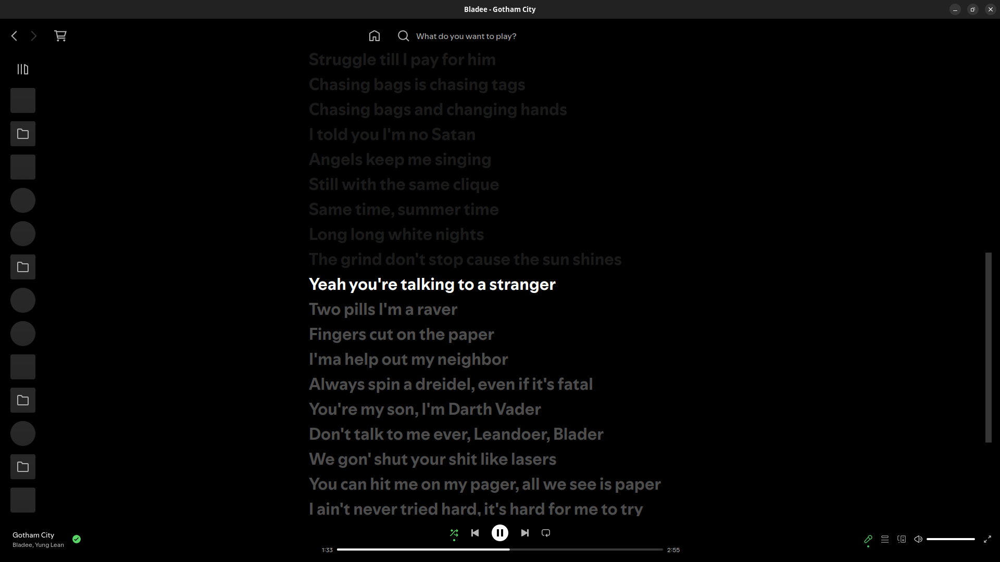            |         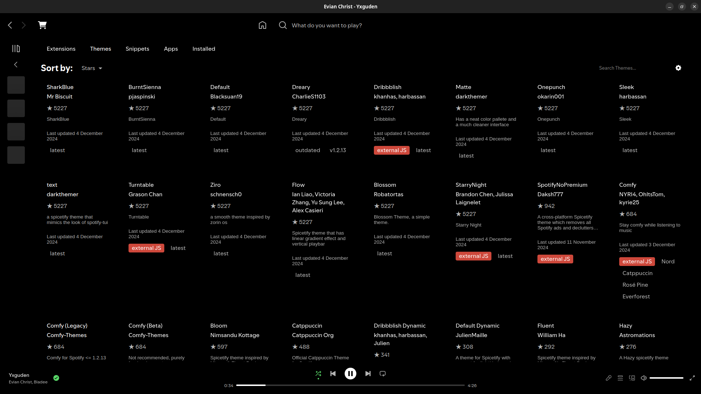         |          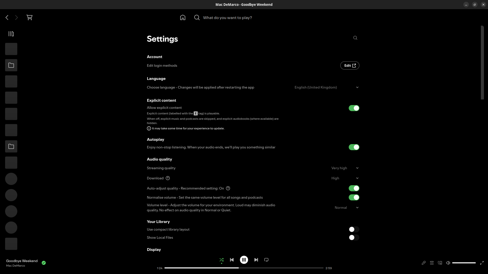          |
|                         lyrics                          |                         marketplace                         |                        settings                         |

## More

[](https://github.com/RasseTheBoy/Amoledify/releases/latest)

[](https://github.com/RasseTheBoy/Amoledify/issues)

### About Amoledify

Minimalistic theme for Spicetify with amoled colors.

Also removes clutter and makes the UI more compact. (May remove something you like, so be sure to check the code and modify it to your liking)

### Information

Designed and developed by [**Rasmus Ohert**](https://github.com/RasseTheBoy)

### Manual install

#### Go to the Themes directory

```bash
# Linux and MacOS
cd "$(dirname "$(spicetify -c)")/Themes"

# Windows
cd "$("$(Split-Path -Path "$(spicetify -c)" -Parent)" + "/Themes")"
```

#### Downoad and apply the theme

```bash
git clone https://github.com/RasseTheBoy/Amoledify.git
spicetify config inject_css 1 replace_colors 1
spicetify config current_theme Amoledify
spicetify apply
```

### Patch

From Spotify > v1.1.62, in sidebar, they use an adaptive render mechanic to actively show and hide items on scroll. It helps reducing number of items to render, hence there is significant performance boost if you have a large playlists collection. But the drawbacks is that item height is hard-coded, it messes up user interaction when we explicity change, in CSS, playlist item height bigger than original value.

Find your Spicetify config directory by running:

```bash
spicetify config-dir
```

Then open `config.ini` and add these 2 lines:

```ini
[Patch]
xpui.js_find_8008 = ,(\w+=)32,
xpui.js_repl_8008 = ,${1}56,
```

### Uninstall

#### Change back to default theme

```bash
# -Change back to default theme-
spicetify config current_theme Marketplace
spicetify apply

# -Remove Amoledify-

## Linux and MacOS
rm -r "$(dirname "$(spicetify -c)")/Themes/Amoledify"

## Windows
rmdir "$("$(Split-Path -Path "$(spicetify -c)" -Parent)" + "/Themes/Amoledify")"
```

### Updating the theme

If you do any changes to the theme, remember to udpate spicetify.

```bash
spicetify apply
```
